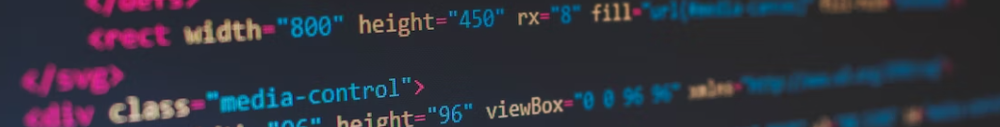

# Практическая работа в рамках [курса Веб‑разработчик](https://practicum.yandex.ru/web/) 

В процессе работы изучаются следующие темы:

- Расширенные возможности HTML и CSS.
- Флексбокс-вёрстка.
- Позиционирование элементов.
- Структура файлов, пути к файлам.
- Изучение Git.
- Декомпозиция проекта по верстке.
- HTML: видео, iframe, embed, API.
- Анимации и трансформации.
- Разметка и вёрстка форм.
- Пути к файлам и организация файлов по БЭМ.
- Дебаггинг в вёрстке.

## Необходимо доработать:

- шрифты;
- добавить видео;
- проверить код на кроссбраузерность и дописать все вендорные префиксы;
- добавить формы.

