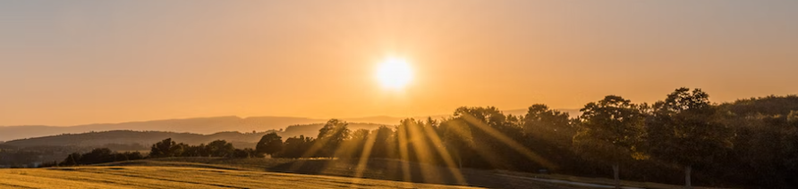

# Практическая работа в рамках [курса Веб‑разработчик](https://practicum.yandex.ru/web/) Яндекс Практикум

 
&nbsp;&nbsp;&nbsp;

 

## Необходимо доработать:

- шрифты;
- добавить видео;
- проверить код на кроссбраузерность и дописать все вендорные префиксы;
- добавить формы.
- +
- +
- +
- +
- +
- +
- +
 
  
  
 

